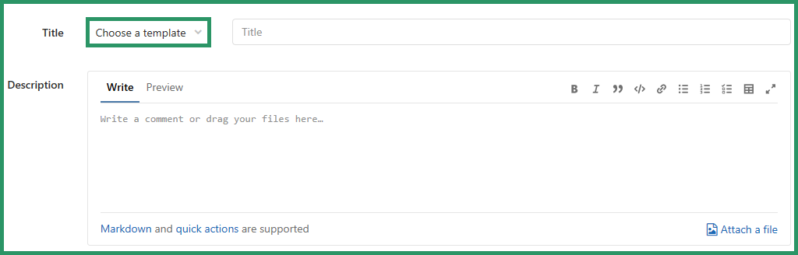

# How to contribute

You found a bug? You thought of an amazing feature you're badly missing? Then feel free to contribute!  
Here are some rules, we kindly ask you to read before getting started.

## Getting started

1. Please create a gitlab account - if you don't already have one :wink: 
2. Done :slight\_smile:  

## Reporting bugs or submitting feature proposals

If you experience a bug in the GitLab-Print-Plugin, or you've got a great idea on how to improve it, then please [create an issue](https://gitlab.com/datev/vuepress-plugin-offlinesearch/issues/new) in our repository.  
For reporting a bug please choose the template "bug", likewise for suggesting a feature request use the template "feature-request".  

The field for choosing a template is located to the left of the text field to enter a title. Choose the one you need, the template will be immediately applied to the description field of the issue.   

   

The template tells you what to do, please just fill in the missing information.  

## What happens next? 

After reporting a new feature proposal, please give the community some time to comment and discuss the proposed feature. After receiving the "green light", you got two options:

1. You're a developer yourself and got some time to kill or need the feature as soon as possible: please feel free to fork our project and implement the feature yourself. Then create a merge request in our project so we can review your changes and merge them with our code.
2. You don't want to (or are not able to) implement the feature by yourself. Your feature will sit in the backlog until a different member of the community implements the feature. There are no guarantees when this will happen. You can monitor the current status of the feature request in the issue.

If you choose to implement a feature by yourself, please remember to follow common Clean Code guidelines and to write tests for the new features as it'll greatly help maintaining the tool in the future.  

The same options apply to bugs aswell with the little difference that you dont't need to wait for any community feedback, so you can start coding immediately.  

Thank you for reading our guidelines and for your future contributions :slight\_smile: